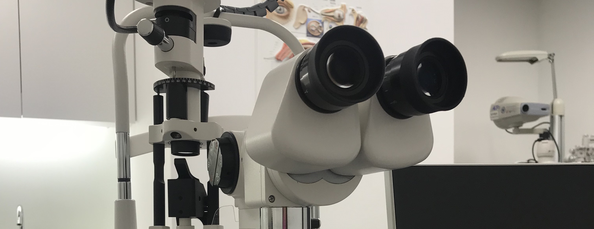

# About me

I am currently a M.S. student in Biostatistics at the Mailman School of Public Health at Columbia.

I graduated from the Polytechnic University of Hong Kong majoring in Optometry. I have worked as a registered optometrist for 3 years and encountered many interesting cases. I am curious about how to leverage data in guiding health related decisions and that's why I'm here.

This is the equipment I used to use everyday and it is really beautiful to look through the lens. 

# About the site

This site contains relevant projects for data science class. NYC restaurant inspection data is briefly analyzed. Find more visualization at [plotly](plotly.html) and [dashboard](dashboard.html).